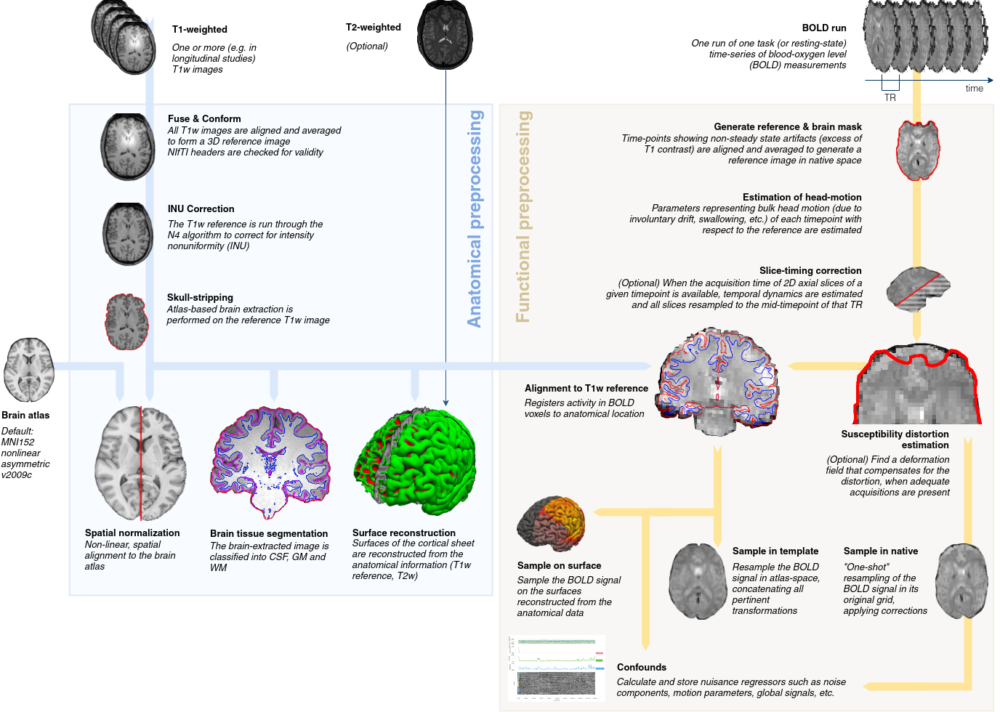

Resting-state Functional MRI (rsfMRI)
=====================================

Synaptic dysfunction has long been hypothesized to be an early event in AD degeneration, and is likely to be reflected in fMRI connectivity.
To derive a functional connectivity map, one needs to specify an anatomical location, or use some data driven technique such as a bootstrap analysis of stable clusters (BASC) (Bellec et al. 2010) to generate a group template of resting-state networks, here the DMN (panel a).
Average time series within the target region/network are derived from a series of individual datasets (panel b), and correlated with the time series of all voxels across the brain, resulting into individual fc-maps (panel c).
Promising results were first reported in the literature on cross-sectional comparisons of fc-maps between patients with AD dementia and cognitively normal (CN) elderly subjects (e.g. REFS), as well a comparisons of patients with MCI of the amnestic type and CN (e.g. ).
Although most published studies feature low sample size, two recent meta-analysis from my group, one combining imaging data of N=255 in CN and MCI participants across four studies (Tam et al. 2015), and another one combining published coordinates from 34 published studies, including N=1363 individuals, point to a consistent dysconnectivity in regions of the default-mode network, as well as alterations in limbic and fronto-parietal networks.
In addition to these clinical comparisons, several studies have reported differences in resting-state connectivity between amyloid beta positive vs negative CN elderly subjects, e.g. (Sheline et al. 2010), as well as differences between CN participants with and without a family history of AD.
Overall, despite still being in its infancy, there is solid evidence at this stage in the literature that rs-fMRI is an early, sensitive marker of the progression of AD (Vemuri, Jones, and Jack 2012).

fMRIprep Pipeline
:::::::::::::

The fMRIprep pipeline, developed by the Poldrack lab at Stanford University, performs basic processing steps (coregistration, normalization, unwarping, noise component extraction, segmentation, skullstripping etc.) providing outputs that can be easily submitted to a variety of group level analyses, including task-based or resting-state fMRI, graph theory measures, surface or volume-based statistics, etc. The fMRIPrep pipeline uses a combination of tools from well-known software packages, including FSL, ANTs, FreeSurfer and AFNI. This pipeline was designed to provide the best software implementation for each state of preprocessing.

The CCNA dataset is processed using fMRIprep version 20.2.1 LTS, which is based on Nipype 1.5.1. Many internal operations of fMRIPrep use Nilearn 0.6.2, mostly within the functional processing workflow. For more details of the pipeline, see [the section corresponding to workflows in fMRIPrep's documentation](https://fmriprep.readthedocs.io/en/latest/workflows.html "FMRIPrep's documentation"). Processing scripts will be made available on github. A full description The log files for execution will be included with the derivatives and can be accessed through the PSOM interface.

Structural processing
---------------------

The T1-weighted (T1w) images were corrected for intensity non-uniformity (INU) with `N4BiasFieldCorrection`, distributed with ANTs 2.3.3, and used as T1w-reference throughout the workflow. The T1w-reference was then skull-stripped with a Nipype implementation of the `antsBrainExtraction.sh` workflow (from ANTs), using OASIS30ANTs as target template. Brain tissue segmentation of cerebrospinal fluid (CSF), white-matter (WM) and gray-matter (GM) were performed on the brain-extracted T1w using `fast` (FSL 5.0.9). Brain surfaces were reconstructed using `recon-all` (FreeSurfer 6.0.1), and the brain mask estimated previously was refined with a custom variation of the method to reconcile ANTs-derived and FreeSurfer-derived segmentations of the cortical gray-matter of Mindboggle. Volume-based spatial normalization to two standard spaces (MNI152NLin2009cAsym, MNI152NLin6Asym) was performed through nonlinear registration with `antsRegistration` (ANTs 2.3.3), using brain-extracted versions of both T1w reference and the T1w template. The following templates were selected for spatial normalization: ICBM 152 Nonlinear Asymmetrical template version 2009c, and FSL's MNI ICBM 152 non-linear 6th Generation Asymmetric Average Brain Stereotaxic Registration Model.

  .. note::
    For more information on the Freesurfer steps and processing please see the section on sMRI.
    

Functional processing
---------------------

Preprocessing
.............

For each of the 1 BOLD runs found per subject (across all tasks and sessions), the following preprocessing was performed. First, a reference volume and its skull-stripped version were generated using a custom methodology of fMRIPrep. Susceptibility distortion correction (SDC) was omitted. The BOLD reference was then co-registered to the T1w reference using `bbregister` (FreeSurfer) which implements boundary-based registration. Co-registration was configured with six degrees of freedom. Head-motion parameters with respect to the BOLD reference (transformation matrices, and six corresponding rotation and translation parameters) are estimated before any spatiotemporal filtering using `mcflirt` (FSL 5.0.9). BOLD runs were slice-time corrected using `3dTshift` from AFNI 20160207. The BOLD time-series (including slice-timing correction when applied) were resampled onto their original, native space by applying the transforms to correct for head-motion. These resampled BOLD time-series will be referred to as preprocessed BOLD in original space, or just preprocessed BOLD. The BOLD time-series were resampled into standard space, generating a preprocessed BOLD run in MNI152NLin2009cAsym space. A reference volume and its skull-stripped version were generated using a custom methodology of fMRIPrep.

Automatic removal of motion artifacts using independent component analysis
..........................................................................
Automatic removal of motion artifacts using independent component analysis (ICA-AROMA) was performed on the preprocessed BOLD on MNI space time-series after removal of non-steady state volumes and spatial smoothing with an isotropic, Gaussian kernel of 6mm FWHM (full-width half-maximum). Corresponding "non-aggresively" denoised runs were produced after such smoothing. Additionally, the "aggressive" noise-regressors were collected and placed in the corresponding confounds file. Several confounding time-series were calculated based on the preprocessed BOLD: framewise displacement (FD), DVARS and three region-wise global signals. FD was computed using two formulations following Power (absolute sum of relative motions, power_fd_dvars) and Jenkinson (relative root mean square displacement between affines, mcflirt). FD and DVARS are calculated for each functional run, both using their implementations in Nipype (following the definitions by 9power_fd_dvars). The three global signals are extracted within the CSF, the WM, and the whole-brain masks.

Additionally, a set of physiological regressors were extracted to allow for component-based noise correction (CompCor). Principal components are estimated after high-pass filtering the preprocessed BOLD time-series (using a discrete cosine filter with 128s cut-off) for the two CompCor variants: temporal (tCompCor) and anatomical (aCompCor). tCompCor components are then calculated from the top 2% variable voxels within the brain mask. For aCompCor, three probabilistic masks (CSF, WM and combined CSF+WM) are generated in anatomical space. The implementation differs from that of Behzadi et al. in that instead of eroding the masks by 2 pixels on BOLD space, the aCompCor masks are subtracted a mask of pixels that likely contain a volume fraction of GM. This mask is obtained by dilating a GM mask extracted from the FreeSurfer's aseg segmentation, and it ensures components are not extracted from voxels containing a minimal fraction of GM.

Finally, these masks are resampled into BOLD space and binarized by thresholding at 0.99 (as in the original implementation). Components are also calculated separately within the WM and CSF masks. For each CompCor decomposition, the k components with the largest singular values are retained, such that the retained components' time series are sufficient to explain 50 percent of variance across the nuisance mask (CSF, WM, combined, or temporal). The remaining components are dropped from consideration. The head-motion estimates calculated in the correction step were also placed within the corresponding confounds file. The confound time series derived from head motion estimates and global signals were expanded with the inclusion of temporal derivatives and quadratic terms for each (confounds_satterthwaite_2013). Frames that exceeded a threshold of 0.5 mm FD or 1.5 standardised DVARS were annotated as motion outliers.

All resamplings can be performed with a single interpolation step by composing all the pertinent transformations (i.e. head-motion transform matrices, susceptibility distortion correction when available, and co-registrations to anatomical and output spaces). Gridded (volumetric) resamplings were performed using `antsApplyTransforms` (ANTs), configured with Lanczos interpolation to minimize the smoothing effects of other kernels. Non-gridded (surface) resamplings were performed using `mri_vol2surf` (FreeSurfer).

Copyright Waiver
................
The above processing boilerplate text was automatically generated by fMRIPrep with the express intention that users may copy and paste the text into their manuscripts unchanged. It is released under the [CC0](https://creativecommons.org/publicdomain/zero/1.0/) license.

Quality control
---------------

Outputs of the fMRIprep pipeline will be subjected to a careful visual inspection and the results quality calls, along with head motion statistics, will be made available on the fMRIprep description. Estimates of the maximum motion (translation and rotation) between consecutive functional volumes for each rs-fMRI dataset will be inspected to categorize the datasets as containing minimal (<1mm or degree), moderate (2 to 3 mm or degrees) or severe motion (>3 mm or degrees). The individual results of the fMRIprep pipeline will be visually inspected for quality of the registration between rs-fMRI and s-MRI data, registration of s-MRI data to template space, and for common artefacts such as ghosting and signal loss. In the case of identification of substandard registration outcomes, a parameter controlling the non-uniformity correction of the s-MRI will be adjusted and the analysis repeated until the coregistration results is satisfactory.

Quality control outputs will include:

* motion statistics distributed in comma-seperated values format (.csv) for each site
* average structural scans after linear and non-linear transformations in compressed nifti format (.nii.gz).
* average functional scans after linear and non-linear transformations in compressed nifti format
* average of all anatomical brain masks for each site of the training and test samples in compressed nifti format (.nii.gz)
* average of all functional brain masks for each site of the training and test samples are included as compressed nifti format (.nii.gz)

  .. note::
    Packages for quality control: registration in particular

1http://www.nitrc.org/plugins/mwiki/index.php/neurobureau:NIAKPipeline
2http://en.wikibooks.org/wiki/MINC 
3http://www.nitrc.org/frs/?group_id=411 
4https://github.com/SIMEXP/niak 
5http://psom.simexp-lab.org/how_to_use_psom.html
